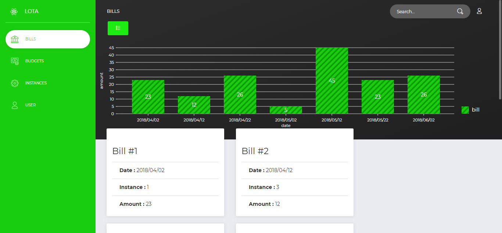
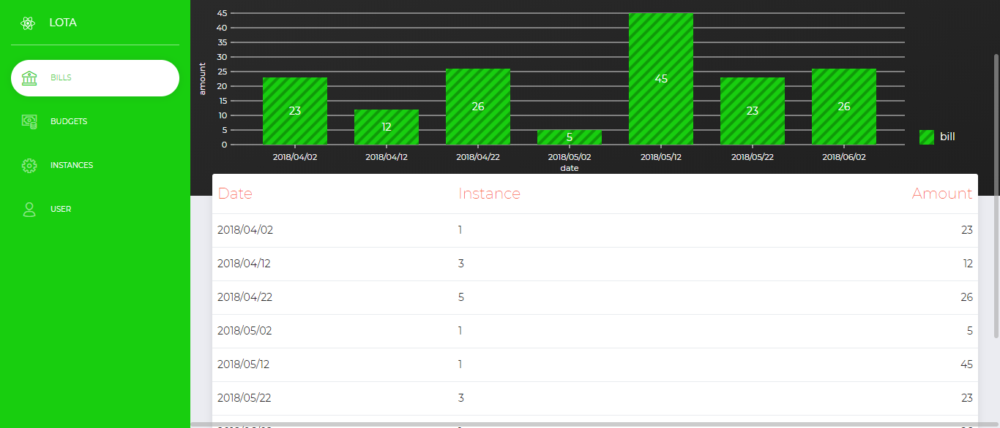

# Lord of The Api

Simple execice d'intégration utilisant React, framework [now ui](https://creative-tim.com/product/now-ui-dashboard-react), [chartjs](https://chartjs.org)

## Contexte :

Dans le cadre du projet lota tu dois developper un tableau de bord permettant à l'utilisateur de visualiser des données

----------------------------------------------

## Consignes :

Developper le tableau de bord grâces aux technologies HTML/CSS/JS et implementer les fonctionalitées obligatoires ci-dessous et si tu as encore le temps et si le coeur t'en dis des fonctionalitées optionelles. Tu es libre de choisir d'utiliser les lib et framework de votre choix.

________________________________________________________

## Liste de fonctionnalitées obligatoires :

* Créer / intégrer un design
* Pouvoir ajouter sur la page une representation graphique des donnée
* Pouvoir choisir les données à representer sur le graphique
* Pouvoir choisir le type de representation graphique

______________________________________________________________

## Liste de fonctionnalitées optionelles :

* Pouvoir ajouter des formules complexes comme source de donnée (par exemple un prix issu du json * un taux de conversion)
* Pouvoir deplacer les graphiques
* Pouvoir resizer les graphiques
* Sur les representations graphiques qui te semble appropriée pouvoir filtrer les données
* Pouvoir dupliquer une representation graphique
* Choisir les couleurs sur les representation graphiques
* Faire une version multilingue
* N'importe quelle fonctionnalité qui te semble interessante

______________________________________________________________
## RESULTAT

```
git clone https://github.com/Gutsover/LoTA
cd LoTA
npm install
npm start
```
Sinon, Test consultable directement sur : https://gutsover.github.io/LoTA




